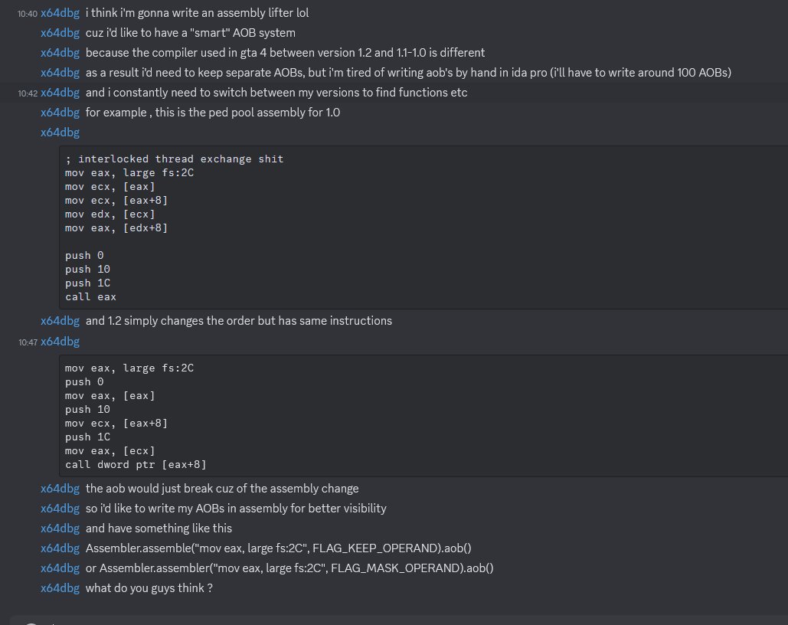

# Reverse Engineering and improving GTA 4 :) IV Definitive Edition

# About
This project attempts to be a fixed version of iv-sdk for GTA 4 : Complete Edition.
Currently compiles as a dll that can be injected at game start.
For now it's still a W.I.P, if you inject it it will open a console with the addresses it managed to grab

CE-Only support for now.
non CE will come very soon

# Features
- Grabbing 9 addresses ???
that's it lmao, reverse engineering is a tough activity and you barely get instant gratification

- Improved eyestep , i added some useful features that ill share some day as a standalone

# IDEAS
- maybe add a lua environnement ? with ability to hook functions on the fly too (like Il2CppLua)

# Building
Get xmake from [XMake's github page](https://github.com/xmake-io/xmake).
```
git clone --recursive https://github.com/elcapor/gta4-modern.git
cd gta4-modern
xmake
```

# Structure
gta4 -> all the dll code

# Note
im tired of writing sick readmes for stuff i dont finish :skull:

BTW the dll unloads itself when u tell it to (this is broken for  now iirc)

I found all the patterns by myself, i didn't take a single pattern from anyone's code, anyone who claims the opposite is deliberately lying and propagating misinformation.

# TODO

[] - Make asserts and more checking for AOBs W.I.P

[] - write a get near func - W.I.P

[] - uml diagram - lazy to do this ong

# Experiments


# Credits
Jayden (thedoomed) - eyestep

Luxx v2 - pattern scan

ItsClonkAndre - Developer of IV SDK NET, helped me a lot

GTA IV Modding Server - supported me and helped me understand some stuff

ElCapor - Developer

IF you might be the developer of a portion of code that has been used here and i didn't credit you feel free to open an issue